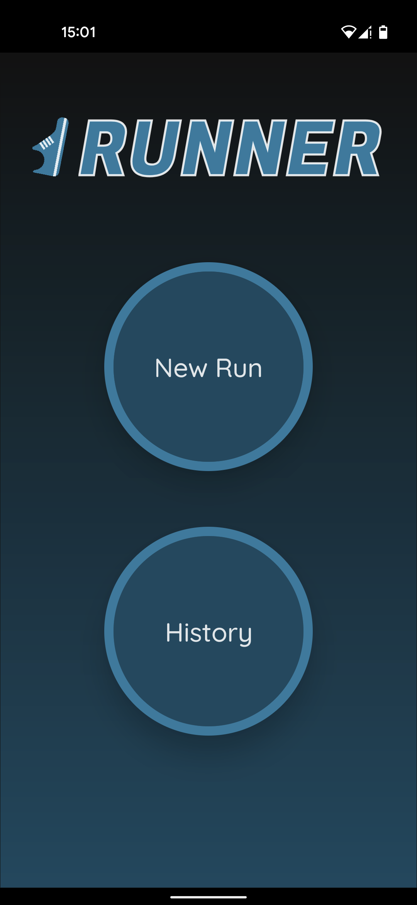
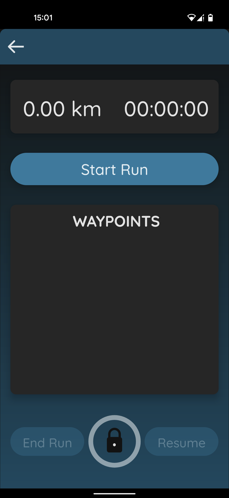
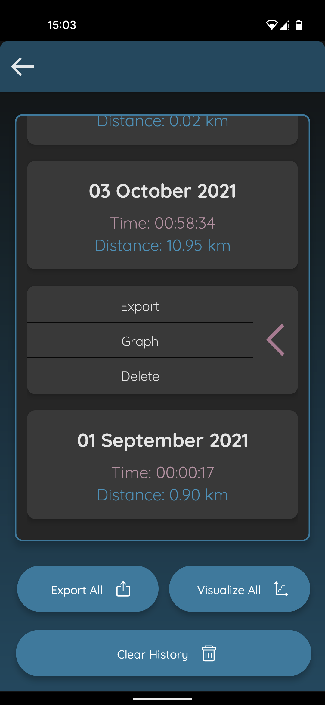
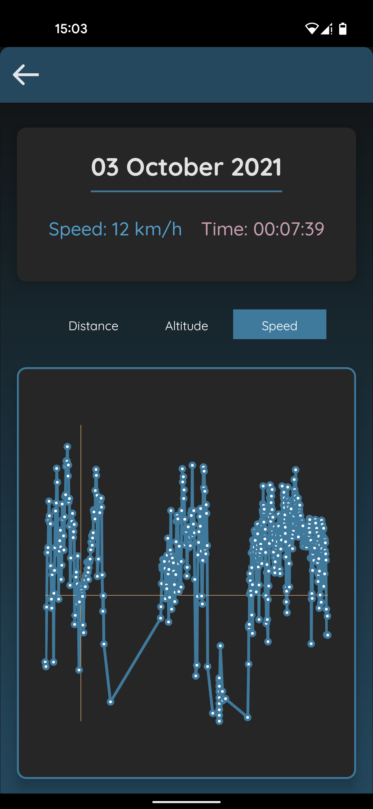
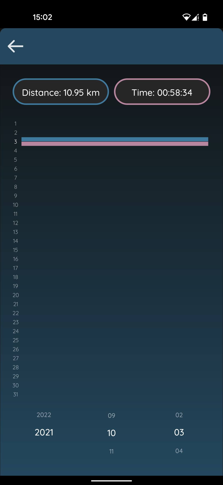

# Running App

An app to track your runs offline. Created with React Native and Typescript, as of yet not optinmized to work on iOS. 

The runs are stored with the React Native Async storage module. 

The app tracks the distance, speed and elevation of your runs and lets you visualize single runs in these three dimensions as well as your run history. 
You can download your runs either as GPX or JSON files to visualize and trace them on a map. 

## The Menu

From here, either start a new run or check your existing runs.

## Where the running happens 

Here you record your data while running. After having pressed start you have to hold down on the lock, after which you can pause or end the run.
Under the "waypoints" header your time taken for each new kilometer is displayed. 

## Your running history 

This section shows all your runs. You can flip each run to reveal the options, either to delete, export as a GPX or JSON file, or graph the run.
You can also delete, export or chart your whole history.

## Graph a single run

The graph visualizes distance, altitude and speed on the y-axis with the time on the x-axis.

## Show all your runs by date in a chart

For this chart all your runs are sorted by date, where you are able to scroll through the years, months and days, to display time and distance for each of the runs.
